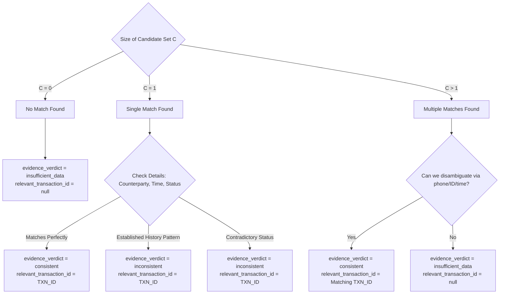

# Part 2: Transaction Evidence Matching Logic

This document details the algorithm and logic rules for analyzing a customer's complaint and matching it against their `transaction_history` to compute:
1.  `relevant_transaction_id` (string or `null`)
2.  `evidence_verdict` (`consistent`, `inconsistent`, `insufficient_data`)

---

## 1. Entity Extraction from Complaint Text

We use a combination of regex parsing and string normalization to extract transaction attributes from the complaint text:

### A. Amount Extraction & Normalization
*   **Bangla Digit Normalization**: Replace Bangla numerals (`০-৯`) with English digits (`0-9`).
    *   *Example*: `২০০০` -> `2000`, `৮৫০` -> `850`.
*   **Bangla Word to Number Mapping**: Parse textual representations of amounts:
    *   `এক হাজার` / `১ হাজার` -> `1000`
    *   `দুই হাজার` / `২ হাজার` / `২০ক` -> `2000`
    *   `পাঁচ হাজার` / `৫ হাজার` -> `5000`
    *   `পাঁচশত` / `৫শত` / `৫০০` -> `500`
*   **Regex Extraction**: Match numbers accompanied by currency keywords:
    *   `(\d+)\s*(taka|tk|টাকা|টাকায়|টাকাটা)`
    *   *Example*: `5000 taka` -> `5000`, `৮৫০ টাকা` -> `850`.

### B. Counterparty Parsing
*   **Phone Numbers**: Search for 11-digit mobile numbers (e.g., `01712345678`, `+8801812345678`).
*   **Identifiers**: Match uppercase patterns for agents and merchants:
    *   `AGENT-\d+` (e.g., `AGENT-318`)
    *   `MERCHANT-\d+` (e.g., `MERCHANT-7821`)
    *   `BILLER-\w+` (e.g., `BILLER-DESCO`)

### C. Transaction Type Keywords
Map complaint phrases to candidate `type` enums:
*   `transfer`: "sent money", "পাঠালাম", "পাঠিয়েছি", "wrong number", "ভুল নম্বর", "brother"
*   `payment`: "electricity bill", "pay bill", "পেমেন্ট", "বিলার", "payment", "recharge", "bill pay"
*   `cash_in`: "cash in", "ক্যাশ ইন", "agent cash in", "এজেন্টের কাছে", "agent deposit"
*   `cash_out`: "cash out", "ক্যাশ আউট"
*   `settlement`: "settle", "settlement", "সেটেলমেন্ট", "sales money", "merchant payment"
*   `refund`: "refund", "reversal", "রিফান্ড", "ফেরত পেয়েছি"

---

## 2. Deterministic Matching Algorithm

Let $T$ be the list of transactions in `transaction_history`. Let $A_c$ be the extracted amount from the complaint, and $Y_c$ be the extracted transaction type.

### Step 0: Early Exit Conditions (Check Before Matching)

Before running any matching, check these special conditions and return immediately:

1.  **Empty Complaint / No Entities Extracted**: If no amount, counterparty, or transaction type was extracted from the complaint AND the complaint is fewer than 15 words long → `evidence_verdict = insufficient_data`, `relevant_transaction_id = null`, `case_type = other`. Ask for details.

2.  **Phishing Case Detected**: If keywords indicate phishing (`otp`, `pin request`, `account block threat`) → skip all transaction matching. Return `relevant_transaction_id = null`, `evidence_verdict = insufficient_data` by design. See Part 3 for routing.

3.  **Unauthorized Transaction Claim**: If the customer says they **did not initiate** a transaction (not "wrong number" but "I never did this"), skip the normal matching engine and route directly to `fraud_risk` / `critical`. See Corner Cases Part 6, Section 2.1.

### Step 1: Filter Candidates
Find all transactions $t \in T$ where:
1.  `abs(t.amount - A_c) / A_c < 0.02` (within ±2% to account for service charges deducted from transfer amount)
2.  $t.\text{type} == Y_c$ (or $Y_c$ is null/unknown)
3.  Transaction list may NOT be sorted — always use `t.timestamp` field directly for time comparisons, never rely on list order.

Let this subset of candidates be $C$.

### Step 2: Resolve Transaction ID and Verdict

#### Scenario A: No matches found ($|C| = 0$)
*   If the history is empty or has no transactions matching $A_c$:
    *   `relevant_transaction_id` = `null`
    *   `evidence_verdict` = `insufficient_data`
    *   *Note*: If the customer reports phishing/social engineering (`case_type = phishing_or_social_engineering`), an empty transaction history is normal and matches this rule.

#### Scenario B: Exactly one match found ($|C| = 1$)
Let the single matching transaction be $t_0$.

*   **Rule B1 (Inconsistent Recipient Pattern)**: If $t_0.\text{type} == \text{"transfer"}$ and the customer claims wrong transfer, check history $T$ for other completed transfers to the same $t_0.\text{counterparty}$ in the 30 days before $t_0$. If $\ge 2$ prior transfers to the same counterparty exist, flag as **inconsistent** (established recipient contradicts "wrong transfer").

*   **Rule B2 (Pending Transaction = Consistent if complaint matches)**: If $t_0.\text{status} == \text{"pending"}$ and the customer reports the transaction has not arrived (e.g. agent cash-in pending, settlement pending), this is **consistent** — the pending status confirms the fund is in limbo. Do NOT mark this as `inconsistent`. Route for human review.
    *   *Example (SAMPLE-07)*: Customer complains 2000 BDT agent cash-in not received. TXN status is `pending`. Evidence = **consistent**, `human_review_required = true`.

*   **Rule B3 (Contradictory Claim vs. Status)**: If the customer claims a transaction failed but $t_0.\text{status}$ is `completed` (with no associated pending reversal), flag as **inconsistent**. Conversely if they claim success but status is `failed`, flag as **insufficient_data** (needs ledger check).

*   **Rule B4 (Consistent)**: Otherwise, if details align (amount matches, type matches, counterparty matches if mentioned), flag as **consistent** and set `relevant_transaction_id` to $t_0.\text{transaction\_id}$.

#### Scenario C: Multiple matches found ($|C| > 1$)
*   **Rule C1 (Disambiguation)**: If the complaint mentions a specific counterparty (phone/ID) or timestamp that matches exactly one candidate $t_m \in C$, set `relevant_transaction_id` = $t_m.\text{transaction\_id}$ and `evidence_verdict` = `consistent`.
*   **Rule C2 (Ambiguous Match)**: If multiple candidates exist and we cannot distinguish which one the user refers to (e.g., two transfers of 1000 BDT to different numbers yesterday), we must not guess:
    *   `relevant_transaction_id` = `null`
    *   `evidence_verdict` = `insufficient_data`
    *   *System Action*: Recommend asking the customer for more details (e.g., the recipient number).

#### Scenario D: Special Cases

*   **Duplicate Payments**: If the customer claims they were charged twice, check if there are two identical transactions (same amount, same counterparty, same type) completed within a short window (strictly **< 60 seconds** apart — SAMPLE-10 shows a real 12-second gap between duplicates).
    *   If two exist within 60s: `relevant_transaction_id` = ID of the **second** (duplicate) transaction, `evidence_verdict` = `consistent`.
    *   If only one exists: `relevant_transaction_id` = ID of the single transaction, `evidence_verdict` = `inconsistent` (claims duplicate but ledger shows single payment).

*   **Failed Payment with Balance Deduction**: This is a critical corner case (SAMPLE-03). The complaint says "app showed failed but balance deducted". In the transaction history, the status is `failed`. This is **consistent** — the customer's complaint matches the ledger status. The system should route to `payments_ops` and note potential balance deduction for investigation. Do NOT mark as `inconsistent` simply because the status is `failed`.

*   **Phishing / No Transactions**: For `phishing_or_social_engineering` cases, an empty `transaction_history` is completely normal. Do NOT try to match transactions. Set `relevant_transaction_id = null` and `evidence_verdict = insufficient_data` by default for these cases.
