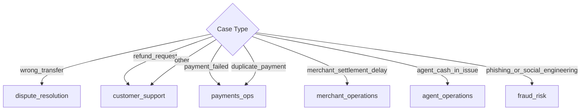

# Part 3: Case Classification and Department Routing

This document defines the rules for mapping inputs to the required enums for:
*   `case_type`
*   `department`
*   `severity`
*   `human_review_required`

Conforming strictly to these mappings guarantees schema validity (15/15 points) and maximizes evidence reasoning accuracy (35/35 points).

---

## 1. Case Type Classification

The classifier must assign the ticket to one of the 8 allowed enums. Text queries are categorized based on semantic markers and keyword triggers:

| Value | Case Definition | Key Trigger Words (English & Bangla) |
| :--- | :--- | :--- |
| `wrong_transfer` | Money sent to the wrong recipient OR wrong amount sent | "wrong transfer", "wrong number", "typing mistake", "ভুল নম্বর", "ভুল নাম্বারে", "ভুল টাকা পাঠিয়েছি", "wrong amount" |
| `payment_failed` | Transaction failed but balance deducted | "payment failed", "balance deducted", "recharge failed", "পেমেন্ট ব্যর্থ", "টাকা কেটেছে", "failed কিন্তু টাকা গেছে" |
| `refund_request` | Customer requests refund for completed purchase | "refund my", "change mind", "return money", "ফেরত চাই", "রিফান্ড", "প্রোডাক্ট নেব না" |
| `duplicate_payment` | Charged twice for the same transaction | "charged twice", "deducted twice", "double payment", "দুইবার কেটেছে", "ডাবল পেমেন্ট", "টাকা ২ বার নিল" |
| `merchant_settlement_delay` | Merchant settlement delayed | "settlement delay", "sales money", "মার্চেন্ট সেটেলমেন্ট", "সেটেলমেন্ট বাকি" |
| `agent_cash_in_issue` | Cash deposit through agent not received | "agent cash in", "agent deposit", "এজেন্ট ক্যাশ ইন", "এজেন্ট টাকা দেয়নি" |
| `phishing_or_social_engineering` | Someone is ASKING the customer for credentials, or threatening account block to steal OTP | "they asked for my OTP", "called saying bKash", "সে পিন চেয়েছে", "একাউন্ট বন্ধ করবে বলেছে" |
| `other` | Account blocked (actual), fee complaints, limit queries, cashback missing, vague loss, unauthorized access, OTP not received (technical) | "I lost money", "account is blocked", "OTP আসছে না", "limit exceeded", "cashback পাইনি", "I didn't make this transfer" |

> ⚠️ **Critical Disambiguation: "account blocked" vs phishing**:
> - `"Someone called and said my account will be blocked if I don't share OTP"` → `phishing_or_social_engineering` (threat used to steal credentials)
> - `"My account is blocked, I can't send money"` → `other` (actual block, technical/support issue)
> - The test: is the customer being **manipulated** by a threat, or **reporting an existing state**?

> ⚠️ **Critical Disambiguation: "wrong transfer" vs "unauthorized transaction"**:
> - `"I accidentally sent to the wrong number"` → `wrong_transfer` (customer initiated, wrong recipient)
> - `"I never made this transfer / someone used my account"` → `other` + `fraud_risk` (customer did NOT initiate — account compromise)

> ⚠️ **Critical Disambiguation: "OTP not received" (tech) vs "asked for OTP" (phishing)**:
> - `"I'm not getting the OTP on my phone"` → `other`, `customer_support`, `low` (technical issue)
> - `"Someone asked me for my OTP"` → `phishing_or_social_engineering`, `critical`

---

## 2. Department Routing Matrix

Departments are assigned strictly based on `case_type` and `evidence_verdict` as follows:

> ⚠️ **Critical Fix**: `refund_request` routes to **`customer_support`** (as per SAMPLE-04), NOT `dispute_resolution`. A refund request for a completed merchant payment is a policy question, not a financial dispute requiring dispute_resolution.

> ⚠️ **insufficient_data Routing**: When `evidence_verdict = insufficient_data` and the case is ambiguous/vague, always fall back to `customer_support` to request more details from the customer.

*   **`fraud_risk`**: Assigned to `phishing_or_social_engineering` and any ticket displaying suspicious or fraudulent activity patterns.
*   **`dispute_resolution`**: Assigned to `wrong_transfer` cases, and to **contested `refund_request`** cases (i.e. refunds the customer is disputing rather than simply requesting as a change of mind).
*   **`payments_ops`**: Assigned to `payment_failed` and `duplicate_payment`.
*   **`merchant_operations`**: Assigned to `merchant_settlement_delay` and any merchant-side complaint (user_type == `merchant`). This is also the default department when `user_type == 'merchant'` even if the case type is otherwise ambiguous.
*   **`agent_operations`**: Assigned to `agent_cash_in_issue` and any agent-side complaint (user_type == `agent`).
*   **`customer_support`**: Assigned to undisputed `refund_request` (change of mind), `other`, and **any case where `evidence_verdict == insufficient_data`** so the system can request more details from the customer.

#### 2.1 Refund request disambiguation

| `case_type` | Sub-condition | Department |
| :--- | :--- | :--- |
| `refund_request` | Customer simply changed their mind / merchant-policy question | `customer_support` |
| `refund_request` | Customer is **contesting** the charge (e.g. unauthorized, duplicate, scam) | `dispute_resolution` |

Detection heuristic for "contested": the complaint contains dispute language such as
`unauthorized`, `didn't make`, `never made`, `someone used`, `fraud`, `scam`, `chargeback`,
combined with a completed debit, OR `evidence_verdict == inconsistent`.

#### 2.2 `insufficient_data` routing

When `evidence_verdict == insufficient_data`, the routing is:

* `phishing_or_social_engineering` -> `fraud_risk` (always).
* `wrong_transfer` -> `dispute_resolution` (the case type still drives the department; the agent just needs clarification before acting).
* `payment_failed` / `duplicate_payment` -> `payments_ops`.
* `merchant_settlement_delay` -> `merchant_operations`.
* `agent_cash_in_issue` -> `agent_operations`.
* Otherwise (including `refund_request`, `other`, or unknown case type) -> `customer_support` so the customer is asked for the missing detail (transaction id, recipient, amount, time). Exception: when the user is a `merchant` or `agent`, the user-type default from §2.3 still wins so the ticket reaches the right team even before clarification arrives.

#### 2.3 User-type variation

`user_type` is an orthogonal input that can override or sharpen the case-type routing.
The allowed values are `customer`, `merchant`, `agent`, `unknown`. Unknown is treated
as `customer`.

| `user_type` | Default department | Notes |
| :--- | :--- | :--- |
| `customer` | Driven by `case_type` (table above) | Default persona. |
| `merchant` | `merchant_operations` | Always. Even if a merchant files a `payment_failed` or a vague `other` complaint, it still goes to `merchant_operations`. Only `phishing_or_social_engineering` overrides this back to `fraud_risk`. |
| `agent` | `agent_operations` | Agent complaints about their own cash operations **and** agent complaints about a customer transaction they facilitated both route here. Only `phishing_or_social_engineering` overrides back to `fraud_risk`. |
| `unknown` | Treated as `customer` (do **not** assume merchant-level routing). If the case is also vague, fall through to `customer_support` so we ask who they are and what happened. | The "vague user" path. |
| _missing / null_ | Same as `unknown` -> treated as `customer`. | The input field is optional per the schema. |

##### 2.3.1 Persona-specific examples

* `user_type = customer` + `payment_failed` -> `payments_ops`
* `user_type = merchant` + `payment_failed` (a customer's payment to them failed) -> `payments_ops` (case-type wins because it is specific; merchant_operations only kicks in when no other department is a better fit)
* `user_type = merchant` + `other` (ambiguous merchant complaint) -> `merchant_operations`
* `user_type = agent` + `other` (agent complaining about their own cash operation) -> `agent_operations`
* `user_type = agent` + `agent_cash_in_issue` -> `agent_operations`
* `user_type = customer` + `merchant_settlement_delay` -> `merchant_operations` (a customer inquiring about a merchant settlement they were promised) -- edge case, still `merchant_operations`.
* `user_type = customer` + `phishing_or_social_engineering` -> `fraud_risk`
* `user_type = merchant` + `phishing_or_social_engineering` -> `fraud_risk` (safety wins over persona)

##### 2.3.2 Priority order (when several rules disagree)

1. Safety: `phishing_or_social_engineering` -> `fraud_risk`.
2. Specific case_type wins over user_type default (e.g. `payment_failed` -> `payments_ops`, even if the reporter is a merchant).
3. Otherwise, user_type default applies (`merchant` -> `merchant_operations`, `agent` -> `agent_operations`).
4. Otherwise, case_type-based department from the matrix above.
5. Fallback: `customer_support` (so we ask for clarification).

##### 2.3.3 Vague user (`user_type = unknown` or missing)

When the system cannot tell who the reporter is, **never assume** merchant-level or
agent-level routing just because the complaint text mentions "merchant" or "agent".
Instead, treat it like a customer and ask for clarification.

| Complaint profile | `user_type` | `case_type` | `evidence_verdict` | Route | Why |
| :--- | :--- | :--- | :--- | :--- | :--- |
| "I lost money. Please help." | `unknown` | `other` | `insufficient_data` | `customer_support` | No idea who they are; ask for both persona + details. |
| "My settlement has not arrived." (no user_type given) | missing/`unknown` | `merchant_settlement_delay` | `consistent` | `merchant_operations` | Case type is specific; the merchant/agent override does not apply here because `user_type` is unknown. |
| "Something is wrong with my account." | `unknown` | `other` | `insufficient_data` | `customer_support` | Vague + unknown persona -> general triage. |
| "I am a merchant and my sales of 15000 taka have not settled." | `merchant` | `merchant_settlement_delay` | `consistent` | `merchant_operations` | Persona confirms, no need to ask. |
| Empty `complaint` + `user_type = unknown` | `unknown` | `other` | `insufficient_data` | `customer_support` | Nothing to act on. |

Rules of thumb:

* **Don't guess a persona.** If `user_type` is missing/`unknown`, fall back to the
  case-type-based department; if the case type is also vague, fall back to
  `customer_support`.
* **Do ask for it.** The `customer_reply` for any `unknown` + `insufficient_data`
  case should politely ask both for the missing transaction detail **and** which
  kind of user they are (customer / merchant / agent) so we can route correctly
  next time.
* **Don't escalate severity on persona ambiguity alone.** A missing `user_type`
  raises neither severity nor `human_review_required`; those still depend on
  the case content.

---

## 3. Severity Matrix

Severity is determined by the potential financial risk, safety impact, and transaction status:

*   **`critical`**:
    *   All `phishing_or_social_engineering` cases (e.g., prompt injection reports, OTP requests).
    *   Threats of account takeover or active credentials compromise.
*   **`high`**:
    *   `wrong_transfer` with `consistent` evidence (actual financial loss occurred).
    *   `payment_failed` with `consistent` evidence (balance deducted on failed transaction).
    *   `duplicate_payment` with `consistent` evidence (duplicate charge verified).
    *   `agent_cash_in_issue` with `consistent` evidence.
*   **`medium`**:
    *   `merchant_settlement_delay` (business impact, but standard batch delay).
    *   Any `wrong_transfer` or `duplicate_payment` with `inconsistent` or `insufficient_data` evidence (needs human review to verify claims).
    *   Ambiguous cases (e.g., multiple matching transactions, requiring clarification).
*   **`low`**:
    *   Undisputed `refund_request` due to change of mind (policy-based handling).
    *   Vague complaints categorized as `other` with `insufficient_data`.

---

## 4. Human Review Required Flags

To minimize support agent fatigue while keeping system security absolute, `human_review_required` is set to `true` under the following conditions:

1.  **Safety/Fraud**: All `phishing_or_social_engineering` cases.
2.  **Dispute / Financial Reversals**: All `wrong_transfer` disputes (completed transactions require human validation before reversal), `agent_cash_in_issue` disputes, and verified `duplicate_payment` cases.
3.  **Contradictions**: Any case where `evidence_verdict` is `inconsistent` (e.g., customer claims duplicate payment but only one transaction is in the history, or claims a wrong transfer to a number they have sent money to multiple times before).
4.  **High-Value Transactions**: Any ticket involving a transaction of amount $\ge 10,000$ BDT.

It can be safely set to `false` when:
*   `case_type` is `payment_failed` and `evidence_verdict` is `consistent` (can be handled by automated ledger reversals).
*   `case_type` is `refund_request` (resolved by standard policy pointing customer to the merchant).
*   `case_type` is `merchant_settlement_delay` and `evidence_verdict` is `consistent` (standard batch delays are resolved automatically by operations).
*   Vague queries categorized as `other` where the system asks for details.
