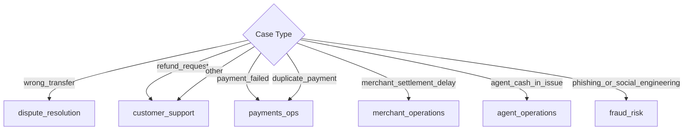

# Part 3: Case Classification and Department Routing

This document defines the rules for mapping inputs to the required enums for:
*   `case_type`
*   `department`
*   `severity`
*   `human_review_required`

Conforming strictly to these mappings guarantees schema validity (15/15 points) and maximizes evidence reasoning accuracy (35/35 points).

---

## 1. Case Type Classification

The classifier must assign the ticket to one of the 8 allowed enums. Text queries are categorized based on semantic markers and keyword triggers:

| Value | Case Definition | Key Trigger Words (English & Bangla) |
| :--- | :--- | :--- |
| `wrong_transfer` | Money sent to the wrong recipient | "wrong transfer", "wrong number", "typing mistake", "ভুল নম্বর", "ভুল নাম্বারে", "অন্য নাম্বারে" |
| `payment_failed` | Transaction failed but balance deducted | "payment failed", "balance deducted", "recharge failed", "পেমেন্ট ব্যর্থ", "টাকা কেটেছে", "রিসার্চ পাইনি" |
| `refund_request` | Customer requests refund for completed purchase | "refund my", "change mind", "return money", "ফেরত চাই", "রিফান্ড", "প্রোডাক্ট নেব না" |
| `duplicate_payment` | Charged twice for the same transaction | "charged twice", "deducted twice", "double payment", "দুইবার কেটেছে", "ডাবল পেমেন্ট", "টাকা ২ বার নিল" |
| `merchant_settlement_delay` | Merchant settlement delayed | "merchant", "settlement delay", "sales money", "মার্চেন্ট সেটেলমেন্ট", "সেটেলমেন্ট বাকি", "পেমেন্ট পাইনি" |
| `agent_cash_in_issue` | Cash deposit through agent not received | "agent cash in", "agent deposit", "এজেন্ট ক্যাশ ইন", "এজেন্ট টাকা দেয়নি", "এজেন্ট থেকে ক্যাশ ইন" |
| `phishing_or_social_engineering` | Suspicious calls or credential theft attempt | "OTP", "PIN", "password", "bKash block", "account suspend", "ওটিপি", "পিন নম্বর", "একাউন্ট ব্লক" |
| `other` | Anything not matching the above | Vague complaints, queries about limit, generic greetings, "check my account", "টাকা সমস্যা" |

---

## 2. Department Routing Matrix

Departments are assigned strictly based on `case_type` and `evidence_verdict` as follows:

> ⚠️ **Critical Fix**: `refund_request` routes to **`customer_support`** (as per SAMPLE-04), NOT `dispute_resolution`. A refund request for a completed merchant payment is a policy question, not a financial dispute requiring dispute_resolution.

> ⚠️ **insufficient_data Routing**: When `evidence_verdict = insufficient_data` and the case is ambiguous/vague, always fall back to `customer_support` to request more details from the customer.

*   **`fraud_risk`**: Assigned to `phishing_or_social_engineering` and any ticket displaying suspicious or fraudulent activity patterns.
*   **`dispute_resolution`**: Assigned to `wrong_transfer` cases only (not refund requests, which are policy-based).
*   **`payments_ops`**: Assigned to `payment_failed` and `duplicate_payment`.
*   **`merchant_operations`**: Assigned to `merchant_settlement_delay`. Also the default department when `user_type == 'merchant'` even if the case type is otherwise ambiguous.
*   **`agent_operations`**: Assigned to `agent_cash_in_issue` and complaints received from a user of type `agent`.
*   **`customer_support`**: Assigned to `refund_request`, `other`, and any case where `evidence_verdict == insufficient_data` and the system is awaiting clarification from the customer.

---

## 3. Severity Matrix

Severity is determined by the potential financial risk, safety impact, and transaction status:

*   **`critical`**:
    *   All `phishing_or_social_engineering` cases (e.g., prompt injection reports, OTP requests).
    *   Threats of account takeover or active credentials compromise.
*   **`high`**:
    *   `wrong_transfer` with `consistent` evidence (actual financial loss occurred).
    *   `payment_failed` with `consistent` evidence (balance deducted on failed transaction).
    *   `duplicate_payment` with `consistent` evidence (duplicate charge verified).
    *   `agent_cash_in_issue` with `consistent` evidence.
*   **`medium`**:
    *   `merchant_settlement_delay` (business impact, but standard batch delay).
    *   Any `wrong_transfer` or `duplicate_payment` with `inconsistent` or `insufficient_data` evidence (needs human review to verify claims).
    *   Ambiguous cases (e.g., multiple matching transactions, requiring clarification).
*   **`low`**:
    *   Undisputed `refund_request` due to change of mind (policy-based handling).
    *   Vague complaints categorized as `other` with `insufficient_data`.

---

## 4. Human Review Required Flags

To minimize support agent fatigue while keeping system security absolute, `human_review_required` is set to `true` under the following conditions:

1.  **Safety/Fraud**: All `phishing_or_social_engineering` cases.
2.  **Dispute / Financial Reversals**: All `wrong_transfer` disputes (completed transactions require human validation before reversal), `agent_cash_in_issue` disputes, and verified `duplicate_payment` cases.
3.  **Contradictions**: Any case where `evidence_verdict` is `inconsistent` (e.g., customer claims duplicate payment but only one transaction is in the history, or claims a wrong transfer to a number they have sent money to multiple times before).
4.  **High-Value Transactions**: Any ticket involving a transaction of amount $\ge 10,000$ BDT.

It can be safely set to `false` when:
*   `case_type` is `payment_failed` and `evidence_verdict` is `consistent` (can be handled by automated ledger reversals).
*   `case_type` is `refund_request` (resolved by standard policy pointing customer to the merchant).
*   `case_type` is `merchant_settlement_delay` and `evidence_verdict` is `consistent` (standard batch delays are resolved automatically by operations).
*   Vague queries categorized as `other` where the system asks for details.
